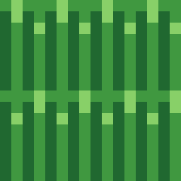
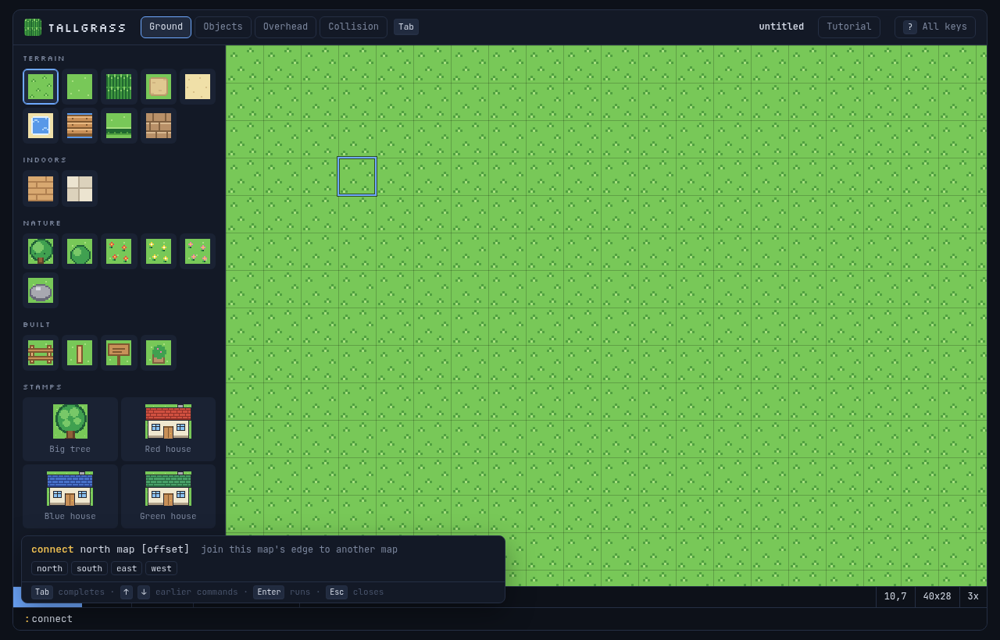
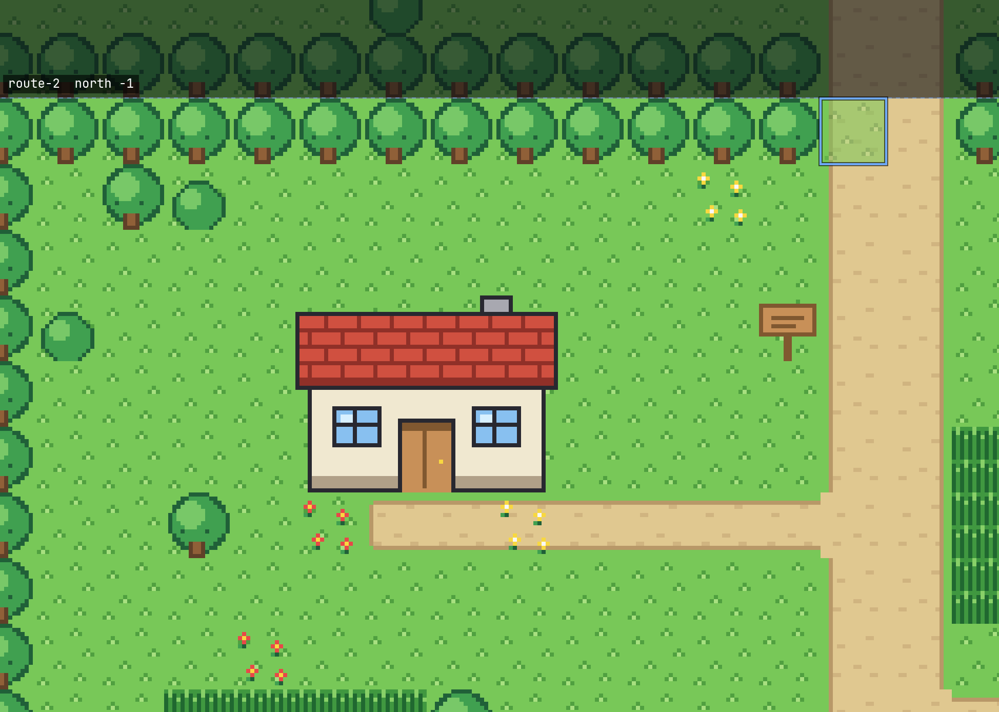
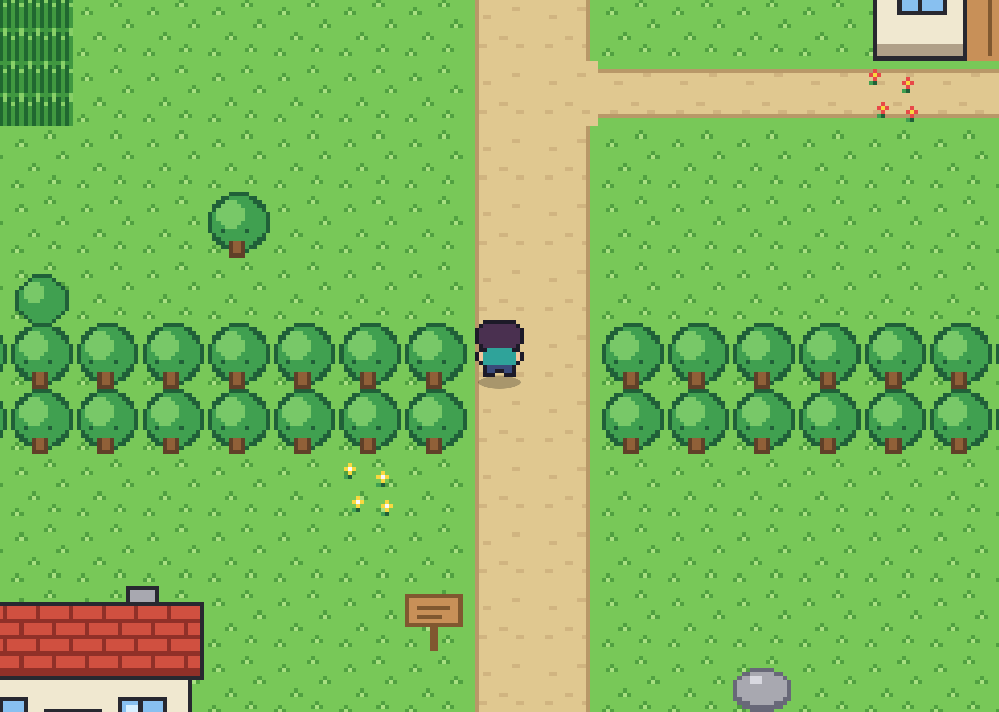
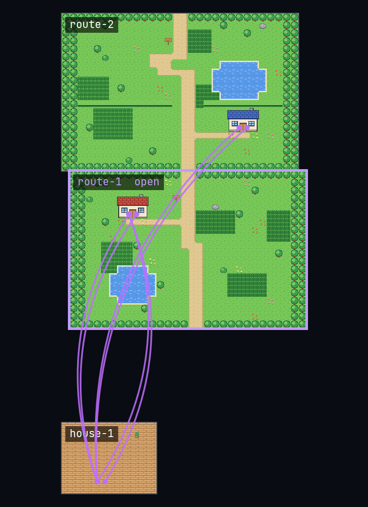

# Tallgrass

A keyboard-first tile map editor for a top-down RPG in the style of the GBA era.
16x16 tiles, one window, no build step. It runs as a native Omarchy app and
still works as a single HTML file in any browser.



## Install

```bash
./install.sh      # launcher entry, icon, `tallgrass` command
./uninstall.sh    # removes them again (your maps stay; --purge also clears session and settings)
```

The installer needs `python-gobject`, `gtk4` and `webkitgtk-6.0`, all from the
official repos and normally already on Omarchy. It installs any that are missing
with `omarchy-pkg-add`. The app is copied to `~/.local/share/tallgrass`, so the
checkout can be moved or deleted afterwards. Re-run `./install.sh` after
pulling changes.

Open it with SUPER + SPACE and type Tallgrass, or from a terminal:

```bash
tallgrass                               # fresh 40x28 grass map
tallgrass maps/route-1.json             # open a map
tallgrass --export route-1.json --out ~/game/assets   # no window, for build scripts
tallgrass --export-world --out ~/game/assets          # every map in the maps folder, plus world.json
```

`--export` writes `<name>.json`, `<name>-tiles.png` and `<name>.png` into
`--out` (default: the current folder), prints the three paths and exits non-zero
on errors. It refuses to overwrite its own input file. It uses WebKit when a
display is available and falls back to headless Chromium when there is none
(for example over SSH).

## Where things live

| What | Where |
| --- | --- |
| Maps (`:w`, `:e`, `:ls`, `:rm`) | `~/Documents/tallgrass/<name>.json`, or `~/tallgrass/` if there is no `~/Documents` |
| `:export` default | `~/Documents/tallgrass/export/` |
| Session autosave and `:restore` | `~/.local/state/tallgrass/session.json` and `previous.json` |
| Last pack you switched to | `~/.local/state/tallgrass/prefs.json` |
| Remembered export folders | `~/.local/state/tallgrass/settings.json` |

`:w` always writes to the maps folder, even for a map opened from somewhere
else. `:rm` moves the file to the trash.

In a plain browser the same commands use `localStorage` and `:export` downloads
the three files.

## Keys

Letter keys use `KeyboardEvent.code`, so they stay in the same physical spot on
any keyboard layout.

| Key | Does |
| --- | --- |
| W A S D, arrows | move the cursor |
| Shift + W A S D | move four cells |
| Space | tap to paint one cell, hold and move to paint |
| X | tap to erase one cell, hold and move to erase |
| Q, E | previous or next tile |
| R | swap back to the last tile |
| T, Ctrl+P | find a tile by name |
| Z, Shift+Z | undo, redo (Ctrl+Z, Ctrl+Y also work) |
| C | pick the tile under the cursor |
| F | flood fill |
| V | select a rectangle; then Space or F fills it, X clears it, C copies it |
| Ctrl+C, Ctrl+V | copy, paste at the cursor |
| 1 2 3 4 | Ground, Objects, Overhead, Collision |
| Tab | cycle layers |
| G, H | grid, collision overlay |
| + - = | zoom in, out, reset |
| P | play mode: walk the map, Esc or P to stop |
| Enter, : | command bar (Tab completes, arrows walk the history) |
| ?, F1 | all keys |
| Ctrl+S | `:w` |
| O, B | go through the door or connected edge under the cursor, come back (Ctrl+O also comes back) |
| [ ] | slide the connection on the cursor's edge by one cell (Shift for four) |
| Mouse | drag paints, right-click picks, wheel pans, Ctrl+wheel zooms |

## The command bar

Everything that isn't painting happens in the command bar at the bottom. Press
**Enter** (or **:**) to open it, type a command such as `w my-map`, and press
**Enter** to run it. **Esc** closes it without running anything.

- While the bar is open, a list above it shows the commands that match what
  you've typed, with an example of each. Once a command is typed, it shows how
  to use it and what **Tab** can fill in (map names, directions, packs).
- **Tab** finishes the word: commands, map names, directions.
- **Up** and **Down** bring back earlier commands.
- `:tutorial`, or the **Tutorial** button at the top, is a two-minute hands-on
  lesson. It works on a practice map and puts your own map back when it ends.



## Commands

| Command | Does |
| --- | --- |
| `:w [name]` | save (and rename) |
| `:e name`, `:e path/to/map.json` | open a saved map, or any map file |
| `:ls` | list saved maps |
| `:rm name` | move a saved map to the trash |
| `:new WxH` | blank grass map |
| `:gen WxH [seed]` | generate a sample route |
| `:resize WxH` | grow or crop from the bottom right |
| `:name name` | rename |
| `:export` | write the three export files to the export folder for this map |
| `:export!` | pick the export folder (for example your game's assets folder); remembered per map |
| `:export ~/game/assets` | export to that folder; remembered per map |
| `:import` | tileset PNG, sliced into 16x16 tiles and stored in the map |
| `:load` | open a map JSON with a file picker |
| `:warp map [x,y]`, `:nowarp` | the door under the cursor leads to a cell in another map (without x,y it lands on that map's door); remove it |
| `:warp! map [x,y]` | same, and `:w` also writes the way back into the other map |
| `:connect dir map [offset]` | join this map's `north`/`south`/`east`/`west` edge to another map; without an offset the walkable cells line up |
| `:disconnect [dir] [map]` | remove a connection (the one at the cursor's edge by default) |
| `:links` | this map's connections, doors and problems |
| `:world` | the world view (see below) |
| `:rename name` | rename the saved map and fix every link that points to it |
| `:export world`, `:export! world`, `:export world DIR` | every map plus `world.json` |
| `:spawn` | the player starts at the cursor |
| `:attr type` | default collision for an imported tile |
| `:layer name`, `:set grid/nogrid/attrs/noattrs/zoom=N` | view options |
| `:pack name` | switch sprite pack (`classic` is built in); remembered for the next launch; `:pack` lists them |
| `:restore` | reopen the previous session |
| `:tutorial` | the command bar lesson |
| `:goto x,y`, `:x,y` | jump to a cell |
| `:q`, `:q!`, `:wq` | quit (refuses with unsaved changes), quit anyway, save and quit |

## Map file format

Saved maps are JSON with `"format": "tallgrass-map"` and `"version": 1`:

```jsonc
{
  "format": "tallgrass-map", "version": 1,
  "name": "route-1", "width": 40, "height": 28, "tileSize": 16,
  "pack": "my-pack",               // only for maps that don't use the built-in Classic pack
  "layers": {                      // grids [height][width] of tile keys, null = empty
    "ground":   [["grass", "path", ...], ...],
    "objects":  [[null, "tree", ...], ...],
    "overhead": [[null, ...], ...]  // drawn above the player
  },
  "attributes": [["auto", "block", ...], ...],   // auto walk block grass water ledge warp spawn
  "warps": { "12,7": "house-1 4,7" },     // door cell -> "map x,y"
  "connections": [{ "dir": "north", "map": "route-2", "offset": 3 }],   // only when the map has any
  "imports": [{ "id": "t1a2b", "name": "my-tiles", "src": "data:image/png;base64,...", "attrs": { "3": "block" } }]
}
```

`:export` writes the same fields plus data for the game:

| Field | Meaning |
| --- | --- |
| `tileset` | `{ image: "<name>-tiles.png", columns: 16, tileCount }` |
| `tileIndices` | per layer, a grid of indices into the atlas (-1 = empty); autotiled variants are resolved |
| `collision` | the resolved attribute grid (`auto` replaced by what the tile says) |
| `events` | `{ type: "warp", x, y, target, map, toX, toY }` and `{ type: "spawn", x, y }` (`map`, `toX`, `toY` are the parsed target) |
| `connections` | as in the saved map |
| `spawn` | the first spawn, or null |
| `tileKeys` | atlas index to tile key |

Files: `<name>.json`, `<name>-tiles.png` (atlas, 16 tiles per row) and
`<name>.png` (the whole map). The export dialog also shows a small JS loader.

## Linked maps

The world is made of maps joined two ways, like the GBA-era RPGs.

- **Doors** (warps): a door cell sends you to a cell in another map, like a house
  interior. `:warp house-1` on a door lands on house-1's door mat; `:warp!`
  also writes the door back when you save. Two-cell doors are set together.
- **Edges** (connections): `:connect north route-2` joins this map's top edge to
  route-2's bottom edge. The offset says where they meet: route-2's left column
  sits `offset` cells right of ours (for east and west edges, cells down). The
  neighbor is drawn faded past the edge; slide it with `[` and `]` until the
  paths line up.

A map's name is its file name. Saving a map updates the other side of each of
its links in the other files (and removes links you took out), and says which
files it touched. `:rename` renames a map and fixes every link to it.



In play mode the player walks across connected edges with no break and through doors
into other maps. Esc always returns to the map you were editing.



`:world` lays out every map by its connections (maps joined only by doors sit
on shelves below), draws doors as lines and marks broken links in red. WASD
pans, + and - zoom, Tab picks a map, Enter opens it.



The checker reports doors to missing maps or cells outside them, doors with no
target, edges without a matching link back, offsets the two sides disagree on,
edges that don't touch, and maps that overlap. `:export world` and
`tallgrass --export-world` write every map plus `world.json`:

```jsonc
{
  "format": "tallgrass-world", "version": 1,
  "maps": [{ "name": "route-1", "file": "route-1.json", "tiles": "route-1-tiles.png", "image": "route-1.png", "width": 40, "height": 28 }],
  "connections": [{ "from": "route-1", "dir": "north", "to": "route-2", "offset": 3 }],   // each seam once
  "warps": [{ "from": "route-1", "x": 12, "y": 7, "to": "house-1", "tx": 4, "ty": 7 }],
  "problems": []
}
```

For the game: when the player steps off the north edge of `route-1` at column
`x`, they enter `route-2` at column `x - offset`, bottom row. Draw neighbors
past the edges at `offset` so the seam is invisible.

## Sprite packs

Tallgrass has one built-in pack, **Classic**: grass, tall grass (wild
encounters), autotiled paths and water, ledges, trees, flowers, fences, houses
and a walking player sprite. Everything is original 16x16 pixel art drawn in
code, so there are no image files to ship.

You can add your own packs. A map remembers its pack, and `:e` switches to it.
Classic maps leave the `pack` field out. `:export` puts only the map's pack
(plus imports and anything the map uses) into the atlas.

### Making a pack

A pack is a script in `src/packs/` that the HTML loads before the editor. It
pushes a definition onto `window.TALLGRASS_PACKS`:

```js
(window.TALLGRASS_PACKS ||= []).push({
  id: "my-pack", name: "My Pack", ground: "mp:grass", brush: "mp:grass",
  text: { encounter: "Something rustles" },         // play mode message
  gen: { ground, tall, path, water, tree, ... },    // roles for :gen, see the Classic pack in tallgrass.html
  iconBg: api => api.paint(16, 16, () => ...),      // behind object icons in the palette
  build(api) { api.addTile("mp:grass", "Grass", "Terrain", "ground", "walk", () => api.fill("#6c4")); },
  sprites(api) { return { down: [stand, stepA, stepB], up: [...], left: [...], right: [...] }; },
});
```

`api` has the same pixel helpers as the built-in tiles (`rf`, `px`, `fill`,
`circ`, `ell`, `edges` for autotiles, `pix` for character-grid art, `mirror`,
`outline`) plus `addTile`, `addStamp`, `paint` and `mk`. Prefix your keys (`mp:`)
so they never clash with other packs, and add a `<script src="packs/...">` tag
where `src/tallgrass.html` marks the spot, before the editor script.

## Omarchy integration

- Window class `tallgrass` (from the GTK program name), `StartupWMClass=tallgrass`.
- Colors come from `~/.local/state/omarchy/current/theme/colors.toml` and reload
  live when the theme changes (the shell watches the folder that
  `omarchy-theme-set` swaps in). If the file can't be read, the built-in colors stay.
  Mapping: background to panels, `dark_background`/`darker_background` to the
  frame and canvas, foreground to text, accent to Edit mode, green to Paint,
  red to Erase, magenta to Select, yellow to Command, cyan to Play.
- The UI font is your system monospace font (`fc-match monospace`); the pixel
  headings use the bundled Silkscreen font (OFL, `src/fonts/`).

## How it is built

- `src/tallgrass.html` is the editor and the single source of truth. All storage
  and file access goes through one small `host` adapter near the top of the
  script: the native shell answers over a WebKit message handler, a plain
  browser falls back to `localStorage` and downloads.
- `shell/tallgrass.py` is the native shell: Python, GTK4 and WebKitGTK 6 via
  PyGObject. It handles files, native file pickers, the theme watcher, the
  clipboard and the command line.
- `assets/tallgrass.png` is the Tall grass tile rendered by the editor itself:
  `python3 shell/tallgrass.py --icon assets/tallgrass.png`.

## Tests

```bash
npm install          # playwright-core only, drives the system Chromium
npm test             # native suite, then the plain-browser suite
```

- `tests/run-native.sh` runs probes inside the real GTK + WebKit shell in
  throwaway folders (never your maps, session or theme). The test window stays
  unmapped so it never takes focus, and keys are dispatched inside the page.
- `tests/browser.mjs` opens the same HTML in headless Chromium with real
  Playwright keyboard input.

`TALLGRASS_MAPS_DIR`, `TALLGRASS_STATE_DIR`, `TALLGRASS_THEME_DIR` and
`TALLGRASS_SRC` override the folders; `TALLGRASS_DEBUG=1` enables the WebKit
inspector (right-click, Inspect Element).

## License

MIT, see [LICENSE](LICENSE). The Silkscreen font is under the SIL Open Font
License (`src/fonts/OFL.txt`).
